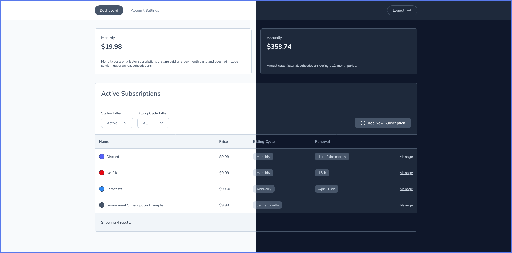

<a name="readme-top"></a>

<div align="center">

<h3 align="center">Subscription Tracker</h3>

  <p align="center">
    A simple dashboard to track your recurring subscriptions.
    <br />
    <a href="https://stdemo.slof.dev">View Demo</a>
  </p>
</div>



<p align="right">(<a href="#readme-top">back to top</a>)</p>

### Built With

-   Laravel 9
-   AlpineJS
-   TailwindCSS

<p align="right">(<a href="#readme-top">back to top</a>)</p>

## Getting Started

### Prerequisites

-   npm, composer
-   Laravel 9 & its requirements

### Installation

1. Clone the repo
    ```sh
    git clone https://github.com/itsmeslof/subscription-tracker.git
    ```
2. Install Composer packages
    ```sh
    composer install
    ```
3. Install NPM packages
    ```sh
    npm install
    ```
4. Build resources
    ```sh
    npm run build
    ```
5. Configure your `.env` file
6. Migrate database
    ```sh
    php artisan migrate --force
    ```
7. Run setup command
    ```sh
    php artisan st:setup # Default login: 'admin@example.com', 'password'
    ```

After running the setup command, you can login with 'admin@example.com', 'password'. **You should change the default email and password.**

If you lose access to your account, you can run `php artisan st:reset-admin` to reset the account login back to default.

<p align="right">(<a href="#readme-top">back to top</a>)</p>

<!-- LICENSE -->

## License

Distributed under the MIT License. See [LICENSE.txt](LICENSE.txt) for more information.

<p align="right">(<a href="#readme-top">back to top</a>)</p>
